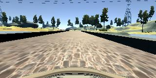
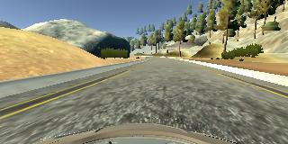
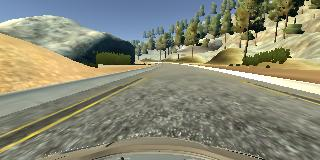
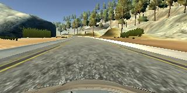
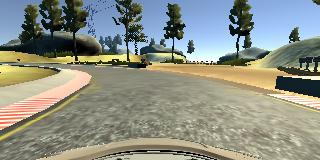
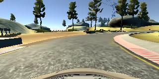

**Behavioral Cloning Project**

The goals / steps of this project are the following:
* Use the simulator to collect data of good driving behavior
* Build, a convolution neural network in Keras that predicts steering angles from images
* Train and validate the model with a training and validation set
* Test that the model successfully drives around track one without leaving the road
* Summarize the results with a written report

## Rubric Points
### Here I will consider the [rubric points](https://review.udacity.com/#!/rubrics/432/view) individually 
and describe how I addressed each point in my implementation.

---
### Files Submitted & Code Quality

#### 1. Submission includes all required files and can be used to run the simulator in autonomous mode

My project includes the following files:
* model.py containing the script to create and train the model
* drive.py for driving the car in autonomous mode
* model.h5 containing a trained convolution neural network 
* README.md summarizing the results

#### 2. Submission includes functional code
Using the Udacity provided simulator and my drive.py file, the car can be driven autonomously around the 
track by executing 
```sh
python drive.py model.h5
```

#### 3. Submission code is usable and readable

The model.py file contains the code for training and saving the convolution neural network. The file shows 
the pipeline I used for training and validating the model, and it contains comments to explain how the code works.

### Model Architecture and Training Strategy

#### 1. An appropriate model architecture has been employed

My model consists of a convolution neural network based on the [NVIDIA architecture](https://arxiv.org/pdf/1604.07316v1.pdf), 
[lines 162-175 in model.py](https://github.com/cwelton/behavior-cloning/blob/master/model.py#L162-L175)

This consists of a series of convolutional layers followed by three dense layers for the final regression.

The model includes RELU activation functions in each of the convolution layers to introduce nonlinearity, 
and the data is normalized in the model using a Keras lambda layer (model.py line 162). 

#### 2. Attempts to reduce overfitting in the model

The model contains dropout layers in order to reduce overfitting (model.py lines 171 and 173). 

The model was trained and validated on different data sets to ensure that the model was not overfitting 
(code line 119-124). The model was tested by running it through the simulator and ensuring that the vehicle 
could stay on the track.

#### 3. Model parameter tuning

The model used an adam optimizer, so the learning rate was not tuned manually (model.py line 175).

#### 4. Appropriate training data

Training data was chosen to keep the vehicle driving on the road. 

I used a combination of center lane driving, recovering from left and right sides of the road, as well ensuring
repeated runs of particularly difficult curves.

In addition to the core training data above I also generated a seperate data set of swerve data where the car
was constantly swerving from left to right.  The purpose of this data was to collect more cases of driving angles
that were difficult to capture in the main training dataset.  However the bulk of this dataset has data that is
poor for traing, so it is carefully pruned to only include the frames at each end of the swerve as the car is
moving back towards center and the angles are pruned back to less severe recovery angles.

For details about how I created the training data, see the next section. 

### Model Architecture and Training Strategy

#### 1. Solution Design Approach

The overall strategy for deriving a model architecture was to begin with some well known architectures and modify 
them as needed to achieve a quality model.

My first step was to use a convolution neural network model similar to the NVIDIA architecture I thought this 
model might be appropriate because it was designed for the core problem being solved in this project, so it 
seemed like a good starting point.

In order to gauge how well the model was working, I split my image and steering angle data into a training and 
validation set. From past projects I knew that it would be valuable to introduce some dropout layers to reduce 
over fitting and that normalization and random flipping of images could also help ensure that the model was well 
conditioned.

Initial tests found that both training and validation numbers would decrease reasonably well, but that the produced 
model led to having the vehicle drive straight off the track at the first corner.

The next step was introducing more training data around the corners and leveraging the side camera images.  
This was able to get the vehicle around the first corner, but the car still wanted to go straight at the corner after 
the bridge.

I got stuck there for a while until I bucketized the training data into discrete angle ranges and ensured that the 
training data saw an equal number of images from each bucket.  This helped reduce the large bias for driving straight
and produced a model that was able to get all the way around the track.

The vehicle still had a tendency to swerve back and forth and a bit more tuning with some of the swerve dataset helped
to reduce, but not eliminate this tendency.

At the end of the process, the vehicle is able to drive autonomously around the track without leaving the road and 
minimal crossing into the lane markers.

#### 2. Final Model Architecture

The final model architecture is a modified NVIDIA architecture, 
[lines 162-175 in model.py](https://github.com/cwelton/behavior-cloning/blob/master/model.py#L162-L175)


#### 3. Creation of the Training Set & Training Process

To capture good driving behavior, I first recorded many laps on track one using center lane driving. 
Here is an example image of center lane driving:



I then recorded the vehicle recovering from the left side and right sides of the road back to center so that the vehicle 
would learn to to correct and move back to the center of the road if it got off course.







To augment the data sat, I also flipped images and angles thinking that this would reduce the bias for making left turns 
around a largely counter clockwise track.





After the collection process, I had 13442 raw readings, each with center, left, and right cameras. These images are
bucketed into histogram buckets of near-straight, slight turn and large turn and the generator will return images
from these buckets with equal frequency. When images are returned there is a 50% chance that the image is flipped,
and images will be selected from between the center left and right options. During the bucketing operation each
bucket is randomly shuffled to reduce the impact of data ordering. The generator function then draws from each
of the buckets equally, and an epoch was arbitrarily set to be 3000 images pulled from this distribution.

15% of the data is separated into a separate test data set that is used during the training process to serve
as a validation that we are not overfitting the data.

I used this training data for training the model. The validation set helped determine if the model was over or 
under fitting. The ideal number of epochs was a little variable from one run to the next, in the final submitted
model it ran for 25 epochs. Evaluation of the model was done both by looking for when the validation_loss stopped
improving and by validation of how well the car performed on the track. I used an adam optimizer so that manually 
training the learning rate wasn't necessary.
